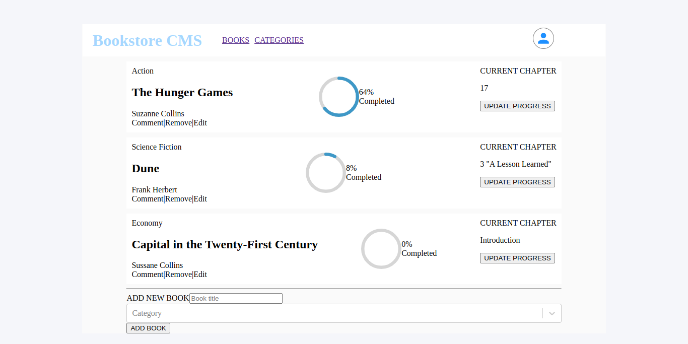

# BookStore CMS



[Demo Link](Coming Soon)

> BookStore CMS is a Single Page Application built using React Library and redux as the state manager with features to display books, add new books and delete any book.

Additional description about the project and its features.

## Built With

- Major languages
- JSX
- SASS & CSS
- JavaScript
- React
- Redux
- React-router
- React Icons

- Technologies used

```bash
- WebHint(Linting tool)
- Jest(for testing)
- Git(version control)
- ESLint(JavaScript linting)
- Stylelint(style linting)
```

## Getting Started

To get a local copy up and running follow these simple example steps.

### Prerequisites

- A text editor(preferably Visual Studio Code)

### Install

- [Git](https://git-scm.com/downloads)
- [Node](https://nodejs.org/en/download/)

### Usage

#### Clone this repository

```bash
git clone
$ https://github.com/netman5/bookStore.git
$ cd bookStore
```

#### Run project

```bash
$ npm install
$ npm build
$ npm test
$ npm start
```

#### Open page in browser

```bash
$ runs on http://localhost:3000/
```

## Author

👤 **Ola Ishola**

- GitHub: [@netman5](https://github.com/netman5)
- Twitter: [@Orlaish](https://twitter.com/Orlaish)
- LinkedIn: [LinkedIn](https://www.linkedin.com/in/ola-ishola/)

## 🤝 Contributing

Contributions, issues, and feature requests are welcome!

Feel free to check the [issues page](https://github.com/netman5/bookStore/issues).

## Show your support

Give a ⭐️ if you like this project!

## 📝 License

This project is [MIT](https://opensource.org/licenses/MIT) licensed.
